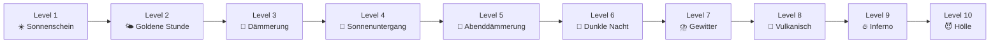

# 🎱 JezzBall – Vollständiges Spielkonzept

> **made by Versteckules**
> Single-File HTML/CSS/JS Canvas-Spiel · PC + Handy · 10 Level · Geocaching-Finale

---

## 1. Spielübersicht

**JezzBall** ist ein Remake des klassischen Windows-Spiels von 1992. Der Spieler muss durch das Setzen von horizontalen oder vertikalen Wänden mindestens **75% des Spielfelds** von den springenden Bällen abgrenzen. Das Spiel hat **10 Level**, wobei der Hintergrund sich stufenweise von **friedlichem Sonnenschein** zu **Hölle** wandelt.

### Kernmechanik
- Klick/Tap auf das Spielfeld → Wand wächst in gewählter Richtung (horizontal/vertikal)
- Wand wächst von der Klickposition aus in beide Richtungen bis zum Rand
- Trifft ein Ball eine wachsende Wand → Wand wird zerstört + 1 Leben verloren
- Bereiche ohne Bälle werden als "cleared" markiert
- ≥75% cleared → Level geschafft → nächstes Level
- Alle Leben weg → Game Over → Neustart ab Level 1

---

## 2. Technische Architektur

### Dateistruktur
```
Jetzzball/
├── index.html      ← Alles in einer Datei (HTML + CSS + JS)
├── Avatar.jpg      ← Wasserzeichen-Bild (vom Nutzer bereitgestellt)
```

### Technologien
| Komponente | Technologie |
|---|---|
| Rendering | HTML5 Canvas (2D Context) |
| Physik | Eigene Ball-Kollisionserkennung (elastisch) |
| Grid-System | Raster-basiert (wie Original JezzBall) |
| Audio | Web Audio API (prozedural, keine externen Dateien) |
| Styling | Vanilla CSS |
| Sprachen | i18n-System mit DE/EN/CZ |

### Spielfeld
- **Responsive**: Passt sich an Bildschirmgröße an
- **Max-Größe**: 900×600 Pixel
- **Grid**: 36×24 Zellen à 25px (bei max. Größe)
- **Skalierung**: Grid passt sich proportional an

---

## 3. Spielmechanik im Detail

### 3.1 Level-System (10 Level)

| Level | Bälle | Leben | Schwierigkeit |
|-------|-------|-------|---------------|
| 1 | 2 | 2 | Einstieg |
| 2 | 3 | 3 | Leicht |
| 3 | 4 | 4 | Moderat |
| 4 | 5 | 5 | Mittel |
| 5 | 6 | 6 | Anspruchsvoll |
| 6 | 7 | 7 | Schwer |
| 7 | 8 | 8 | Sehr schwer |
| 8 | 9 | 9 | Extrem |
| 9 | 10 | 10 | Brutal |
| 10 | 11 | 11 | Finale |

> **Regel**: Leben pro Level = Anzahl Bälle (Level + 1)

### 3.2 Scoring (angelehnt an Original)
- **Basis-Punkte**: Für jede fertig gesetzte Wand = Prozent der damit gecleared-en Fläche
- **Level-Bonus**: Bei Levelabschluss = (clearPercent - 75) × Level × 100
- **Score wird über alle Level akkumuliert**

### 3.3 Wand-Mechanik
- Nur **eine aktive Wand** gleichzeitig erlaubt
- Wand wächst vom Klickpunkt in **beide Richtungen** gleichzeitig
- Wachstumsgeschwindigkeit: Konstant (konfigurierbar)
- Fertige Wand → Grid-Zellen werden als "wall" markiert → Flood-Fill prüft eingeschlossene Bereiche
- Ball trifft wachsende Wand → Wand zerstört → Leben -1 → Explosions-Partikeleffekt

### 3.4 Ball-Physik
- Elastische Kollision zwischen Bällen
- Reflexion an Wänden (Spielfeldrand + fertige Wände)
- Radius: 8-10px (skaliert mit Grid)
- Geschwindigkeit: Leicht zufällig pro Ball, minimal schneller mit jedem Level

### 3.5 Steuerung

| Aktion | PC | Handy |
|--------|-----|-------|
| Wand setzen | Linksklick | Tap |
| Richtung wechseln | Rechtsklick | Toggle-Button |
| Richtungsanzeige | Cursor ändert sich | Button-Label |

---

## 4. Visuelles Design

### 4.1 Hintergrund-Wandel (10 Stufen)



#### Farbpalette pro Level

| Level | Himmel oben | Himmel unten | Akzent | Boden |
|-------|------------|-------------|--------|-------|
| 1 | `#87CEEB` (Himmelblau) | `#FFE4B5` (Pfirsich) | `#FFD700` (Gold) | `#228B22` (Grün) |
| 2 | `#87CEEB` → `#FFA500` | `#FFE4B5` | `#FFA500` | `#228B22` |
| 3 | `#FF8C42` → `#5D275D` | `#FFB347` | `#FF6347` | `#8B4513` |
| 4 | `#D35400` → `#5D275D` | `#FF6347` | `#FF4500` | `#654321` |
| 5 | `#5D275D` → `#2D1B4E` | `#D35400` | `#8B0000` | `#3C280D` |
| 6 | `#1A1A2E` → `#16213E` | `#2D1B4E` | `#4169E1` | `#1A1A1A` |
| 7 | `#0D0D1A` → `#1A0A2E` | `#16213E` | `#9400D3` (Blitz) | `#0D0D0D` |
| 8 | `#1A0000` → `#330000` | `#660000` | `#FF4500` | `#1A0000` |
| 9 | `#330000` → `#660000` | `#8B0000` | `#FF0000` | `#330000` |
| 10 | `#4A0000` → `#8B0000` | `#FF0000` | `#FF6600` | `#4A0000` |

#### Hintergrund-Elemente pro Level

| Level | Elemente |
|-------|----------|
| 1-2 | Sonne, Wolken, Vögel, grüne Hügel |
| 3-4 | Untergehende Sonne, orange Wolken, Berge |
| 5-6 | Mond, Sterne, dunkle Berge |
| 7 | Blitze (animiert), Regentropfen, violetter Himmel |
| 8-9 | Vulkan-Silhouette, Lava-Partikel, Glut |
| 10 | Flammen von unten, brennender Himmel, Asche-Partikel |

### 4.2 Ball-Design

- **Form**: Kreise mit radialem Gradient (3D-Effekt)
- **Glow**: `shadowBlur` passend zum Level-Thema
- **Farben**: 
  - Level 1-3: Leuchtend blau/cyan (`#00BFFF` → `#0080FF`)
  - Level 4-6: Violett/magenta (`#9400D3` → `#FF00FF`)
  - Level 7-8: Orange/gelb (`#FFA500` → `#FFD700`)
  - Level 9-10: Rot/feuerrot (`#FF0000` → `#FF4500`)
- **Trail-Effekt**: Leichter Nachschweif beim Bewegen

### 4.3 Wand-Design (Neon-Glow)

- **Wachsende Wand**: 
  - Pulsierender Glow-Effekt (sinusförmige Helligkeit)
  - Farbe passend zum Level (blau → rot)
  - Leuchtende Spitze an den Wachstumspunkten
- **Fertige Wand**: 
  - Solide Linie mit subtilerem Glow
  - Leicht dunkler als wachsende Wand
- **Zerstörte Wand**:
  - Explosions-Partikel (8-12 Partikel)
  - Fade-Out über 0.5 Sekunden
  - Screen-Shake (2-3px, 200ms)

### 4.4 Spielfeld-Flächen

- **Freier Bereich**: Leicht transparent, zeigt Hintergrund durch
- **Gecleared Bereich**: Halbtransparent gefüllt, Muster/Textur passend zum Level
- **Wand-Zellen**: Solide Farbe mit Glow

### 4.5 HUD (Glasmorphism-Dashboard)

```
┌─────────────────────────────────────────────────────┐
│  ⬜ Area: 42%  │  ⭐ Score: 1250  │  🏁 Runde: 3  │  ❤️❤️❤️❤️ │
└─────────────────────────────────────────────────────┘
```

- **Stil**: `backdrop-filter: blur(10px)`, `background: rgba(255,255,255,0.15)`
- **Rand**: `border: 1px solid rgba(255,255,255,0.3)`
- **Ecken**: `border-radius: 15px`
- **Position**: Oben zentriert, 15px Abstand
- **Area-Anzeige**: Fortschrittsbalken (grün bei 0%, gold bei 75%+)

### 4.6 Avatar-Wasserzeichen

- Gleiche Technik wie Dragon Hero: Bild laden → Pixel verarbeiten → halbtransparent
- Dezent in der Mitte des Spielfelds
- Opacity: 5-8% (kaum sichtbar, aber spürbar)
- Passt sich Spielfeldgröße an

---

## 5. Audio-System (Web Audio API)

### 5.1 Hintergrundmusik (Prozedural)

Atmosphärische **Drone-Sounds** die sich mit dem Level verändern:

| Level | Musik-Charakter | Frequenz-Basis | Filter |
|-------|----------------|----------------|--------|
| 1-2 | Sanft, warm, friedlich | C4 (261 Hz) | Low-Pass 800Hz |
| 3-4 | Leicht melancholisch | A3 (220 Hz) | Low-Pass 600Hz |
| 5-6 | Dunkel, mystisch | F3 (174 Hz) | Low-Pass 400Hz |
| 7-8 | Bedrohlich, pulsierend | D3 (146 Hz) | Low-Pass 300Hz, LFO |
| 9-10 | Aggressiv, Drone | A2 (110 Hz) | Distortion, Low-Pass 200Hz |

- **Oszillator-Typen**: Triangle (friedlich) → Sawtooth (düster) → Square (aggressiv)
- **LFO**: Langsame Modulation für lebendigen Klang
- **Übergang**: Sanfter Crossfade beim Level-Wechsel (2 Sekunden)

### 5.2 Sound-Effekte

| Event | Sound |
|-------|-------|
| Wand platziert | Kurzer "Whoosh" (Noise-Burst + High-Pass) |
| Wand fertig | Bestätigungston (2 Sinustöne aufsteigend) |
| Wand zerstört | Crash (Noise-Burst + Low-Pass, schneller Decay) |
| Ball-Bounce | Leiser "Tick" (sehr kurzer Sinus-Puls) |
| Level geschafft | Fanfare (aufsteigende Tonfolge C-E-G-C) |
| Game Over | Absteigender Ton + dumpfer Bass |
| Leben verloren | Kurzer Warnton |

### 5.3 Musik-Toggle

- Button oben links: `🎵 Musik: ON` / `🔇 Musik: OFF`
- Gleicher Stil wie Dragon Hero
- Speichert Einstellung im `localStorage`

---

## 6. UI-Screens

### 6.1 Startmenü

```
┌──────────────────────────────────────┐
│                                      │
│          [Avatar.jpg]                │
│         (180px, rund)                │
│                                      │
│         J E Z Z B A L L             │
│       made by Versteckules           │
│                                      │
│     [🇩🇪] [🇬🇧] [🇨🇿]              │
│                                      │
│  ┌────────────────────────────────┐  │
│  │         SPIELREGELN:          │  │
│  │                               │  │
│  │ • Klicke aufs Spielfeld um    │  │
│  │   eine Wand zu setzen         │  │
│  │ • Rechtsklick / Button =      │  │
│  │   Richtung wechseln           │  │
│  │ • Schließe ≥75% der Fläche   │  │
│  │   ab, ohne dass Bälle die     │  │
│  │   wachsende Wand treffen      │  │
│  │ • Jedes Level hat mehr Bälle  │  │
│  │ • Nach Level 10 wartet eine   │  │
│  │   Belohnung auf dich!         │  │
│  └────────────────────────────────┘  │
│                                      │
│      [ ▶ SPIEL STARTEN ]            │
│                                      │
└──────────────────────────────────────┘
```

- **Hintergrund**: Gleicher animierter Level-1-Hintergrund (Sonnenschein)
- **Avatar**: Rund, mit Glow-Rand
- **Titel**: Großer Text mit Text-Shadow-Glow
- **Flaggen**: 3 kleine Buttons für DE/EN/CZ
- **Start-Button**: Pulsierender Glow-Effekt

### 6.2 Level-Übergang

- **"RUNDE X GESCHAFFT!"** mit Bonus-Punkte-Animation
- Kurze Pause (2 Sekunden)
- Hintergrund morpht zum neuen Level
- **"RUNDE X+1 – X+2 BÄLLE!"** als Vorwarnung

### 6.3 Game Over

- **Screen-Shake** + rote Vignette
- **"GAME OVER"** Text mit Glitch-Effekt
- Finaler Score + höchster erreichter Level
- **"NEUSTART"** Button (großer roter Kreis wie Dragon Hero)

### 6.4 Sieg-Popup (nach Level 10)

- Gleiche Struktur wie Dragon Hero Victory-Popup
- **"SYSTEM GEKNACKT"** Titel
- Koordinaten-Anzeige (Base64-decodiert)
- Screenshot-Hinweis

---

## 7. Mehrsprachigkeit (i18n)

### Implementierung
```javascript
const LANG = {
  de: {
    title: "JezzBall",
    subtitle: "made by Versteckules",
    startButton: "Spiel Starten",
    rules: [
      "Klicke aufs Spielfeld um eine Wand zu setzen",
      "Rechtsklick / Button = Richtung wechseln",
      "Schließe ≥75% der Fläche ab",
      "Wenn ein Ball die wachsende Wand trifft, verlierst du ein Leben",
      "Nach Level 10 wartet eine Belohnung!"
    ],
    area: "Fläche",
    score: "Punkte",
    round: "Runde",
    lives: "Leben",
    horizontal: "Horizontal",
    vertical: "Vertikal",
    direction: "Richtung",
    gameOver: "SPIEL VORBEI",
    restart: "NEUSTART",
    roundComplete: "RUNDE {n} GESCHAFFT!",
    nextRound: "RUNDE {n} – {balls} BÄLLE!",
    victory: "SYSTEM GEKNACKT",
    victoryText: "Glückwunsch! Hier sind die Final-Koordinaten:",
    screenshot: "Am besten sofort einen Screenshot machen!",
    musicOn: "🎵 Musik: ON",
    musicOff: "🔇 Musik: OFF"
  },
  en: {
    title: "JezzBall",
    subtitle: "made by Versteckules",
    startButton: "Start Game",
    rules: [
      "Click on the field to place a wall",
      "Right-click / Button = toggle direction",
      "Clear ≥75% of the area",
      "If a ball hits a growing wall, you lose a life",
      "A reward awaits after Level 10!"
    ],
    area: "Area",
    score: "Score",
    round: "Round",
    lives: "Lives",
    horizontal: "Horizontal",
    vertical: "Vertical",
    direction: "Direction",
    gameOver: "GAME OVER",
    restart: "RESTART",
    roundComplete: "ROUND {n} COMPLETE!",
    nextRound: "ROUND {n} – {balls} BALLS!",
    victory: "SYSTEM CRACKED",
    victoryText: "Congratulations! Here are the final coordinates:",
    screenshot: "Better take a screenshot right now!",
    musicOn: "🎵 Music: ON",
    musicOff: "🔇 Music: OFF"
  },
  cz: {
    title: "JezzBall",
    subtitle: "made by Versteckules",
    startButton: "Spustit hru",
    rules: [
      "Kliknutím na hrací pole umístíte zeď",
      "Pravé tlačítko / Button = přepnout směr",
      "Uzavřete ≥75% plochy",
      "Pokud míč narazí do rostoucí zdi, ztratíte život",
      "Po úrovni 10 na vás čeká odměna!"
    ],
    area: "Plocha",
    score: "Skóre",
    round: "Kolo",
    lives: "Životy",
    horizontal: "Horizontální",
    vertical: "Vertikální",
    direction: "Směr",
    gameOver: "KONEC HRY",
    restart: "RESTART",
    roundComplete: "KOLO {n} DOKONČENO!",
    nextRound: "KOLO {n} – {balls} MÍČŮ!",
    victory: "SYSTÉM PROLOMEN",
    victoryText: "Gratulujeme! Zde jsou finální souřadnice:",
    screenshot: "Raději si hned udělejte screenshot!",
    musicOn: "🎵 Hudba: ON",
    musicOff: "🔇 Hudba: OFF"
  }
};
```

- **Sprachwahl**: 3 Flaggen-Buttons im Startmenü
- **Persistenz**: `localStorage.setItem('jezzball-lang', 'de')`
- **Dynamisch**: Alle Texte werden über `t('key')` Funktion geladen

---

## 8. Implementierungsplan (Schrittweise)

### Phase 1: Grundgerüst
1. HTML-Struktur (Canvas, Startmenü, HUD, Overlays)
2. CSS-Styling (Glasmorphism, Responsive Layout)
3. Canvas-Setup + Responsive Sizing
4. Grid-System initialisieren

### Phase 2: Spielmechanik
5. Ball-Klasse (Rendering, Bewegung, Reflexion an Rändern)
6. Ball-zu-Ball-Kollision (elastisch)
7. Bar/Wand-Klasse (Wachstum, Rendering)
8. Wand-Kollisionen (Ball trifft wachsende Wand → zerstört)
9. Wand fertig → Grid-Update → Flood-Fill-Algorithmus
10. Area-Clearing-Logik (eingeschlossene Bereiche erkennen)

### Phase 3: Game State
11. Level-System (Leben, Score, Runden)
12. Level-Übergang (Animation + neues Setup)
13. Game Over + Neustart
14. Sieg-Bedingung (Level 10 geschafft → Koordinaten)

### Phase 4: Visuelles Polish
15. Hintergrund-System (10 Stufen)
16. Ball-Glow + Level-angepasste Farben
17. Wand-Neon-Glow + Partikeleffekte
18. HUD Glasmorphism
19. Avatar-Wasserzeichen
20. Screen-Transitions + Animationen

### Phase 5: Audio + i18n
21. Web Audio API Setup
22. Prozedurale Hintergrundmusik (Level-adaptiv)
23. Sound-Effekte
24. Musik-Toggle
25. i18n-System (DE/EN/CZ)
26. Sprachwahl + localStorage

### Phase 6: Polish & Mobile
27. Touch-Events + mobile Optimierung
28. Richtungs-Toggle-Button (für Handy)
29. Performance-Optimierung
30. Endtest auf verschiedenen Geräten

---

## 9. Offene Punkte

> [!IMPORTANT]
> **Koordinaten**: Platzhalter-Koordinaten werden eingebaut. Der Nutzer ändert sie später selbst im Code (Base64-String suchen und ersetzen).

> [!NOTE]
> **Avatar.jpg**: Muss vom Nutzer im gleichen Ordner wie index.html bereitgestellt werden. Das Spiel funktioniert auch ohne (dann kein Wasserzeichen).

---

## 10. Zusammenfassung der Entscheidungen

| Frage | Entscheidung |
|-------|-------------|
| Spielfeld-Größe | Responsive (max 900×600) |
| Leben-System | Level + 1 Leben pro Level |
| Steuerung Handy | Tap + Toggle-Button |
| Musik | Web Audio API, prozedural, level-adaptiv |
| Hintergrund | 10-Stufen-Gradient (Sonne → Hölle) |
| Ball-Design | Glow-Bälle, Farbe passt sich Level an |
| Wand-Design | Neon-Glow, pulsierend, Partikel bei Zerstörung |
| HUD | Glasmorphism-Dashboard oben |
| Nach Level 10 | Geocaching-Koordinaten (Platzhalter) |
| Dateiformat | Single-File (index.html) |
| Audio | Komplett Web Audio API (keine externen Dateien) |
| Avatar | Wasserzeichen (Avatar.jpg, wie Dragon Hero) |
| Spieltitel | JezzBall |
| Sprachen | DE / EN / CZ mit Flaggen-Auswahl |
